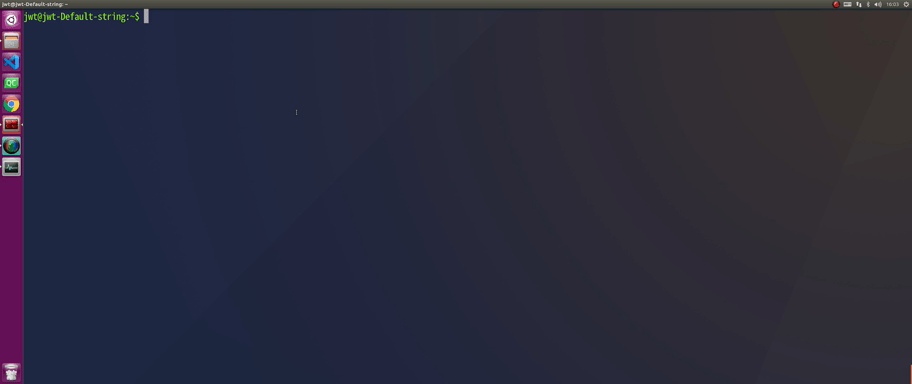
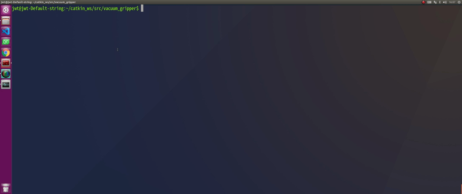
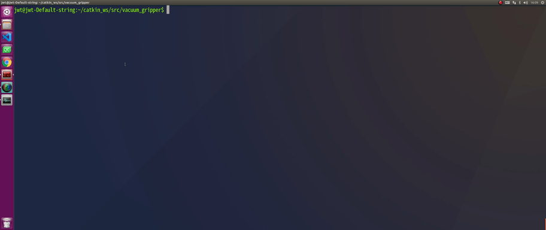

# Vacuum_Gripper
JWT Robot Controller vacuum gripper control pkg

# Install
```
mkdir -p ~/catkin_ws/src
cd ~/catkin_ws/src
git clone https://github.com/kimku-0112/vacuum_gripper.git
```
<center></center>

# rebuild
```
cd ~/catkin_ws/src/vacuum_gripper
./rebuild.sh
```

<center></center>

# build
```
cd ~/catkin_ws/src/vacuum_gripper
./build.sh
```

<center></center>

# Main launch

## Vacuum gripper control node launch
```
cd ~/catkin_ws/src/vacuum_gripper
./1.suction_and_blow.sh
```

<center></center>


# publish Test node launch
## Set vaccum gripper Mode (Off = 0 / suction = 1 / blow off = 2)
```
cd ~/catkin_ws/src/vacuum_gripper
./2.pub_suction_and_blow.sh
```

<center></center>


# demo

<center></center>
